# Contractor Vault - System Architecture

## High-Level Architecture

```mermaid
flowchart TB
    subgraph Users["👥 Users"]
        Admin["🔑 Admin<br/>(Session Owner)"]
        Contractor["👷 Contractor<br/>(Session Consumer)"]
    end

    subgraph Extension["🧩 Chrome Extension"]
        Popup["Popup UI"]
        BG["Background Worker"]
        Cookie["Cookie Manager"]
    end

    subgraph Cloud["☁️ Cloud Infrastructure"]
        subgraph API["FastAPI Backend"]
            Sessions["/api/sessions"]
            Tokens["/api/sessions/generate-token"]
            Claim["/api/sessions/claim/{token}"]
            Audit["/api/audit-log"]
        end
        
        DB[(PostgreSQL)]
        
        subgraph Security["🔒 Security Layer"]
            RateLimit["Rate Limiter<br/>slowapi"]
            CORS["CORS Filter"]
            Encrypt["Fernet Encryption"]
        end
    end

    subgraph Dashboard["📊 Admin Dashboard"]
        NextJS["Next.js App"]
    end

    Admin --> Popup
    Popup --> BG
    BG --> Cookie
    BG -->|Store Session| Sessions
    BG -->|Generate Token| Tokens
    
    Contractor --> Popup
    BG -->|Claim Token| Claim
    
    Sessions --> Security
    Tokens --> Security
    Claim --> Security
    Security --> DB
    
    NextJS --> Sessions
    NextJS --> Audit
```

---

## Data Flow

---

## Deployment Architecture

---

## Security Model

| Layer | Protection |
|-------|------------|
| **Transport** | HTTPS/TLS encryption |
| **Authentication** | JWT tokens with expiry |
| **Data at Rest** | Fernet symmetric encryption |
| **Rate Limiting** | 5-30 req/min per IP |
| **CORS** | Restricted to extension + dashboard |
| **Audit Trail** | All actions logged immutably |

---

## Component Details

| Component | Technology | Purpose |
|-----------|------------|---------|
| **Backend API** | FastAPI + SQLAlchemy | Session storage, token management |
| **Database** | PostgreSQL (prod) / SQLite (dev) | Encrypted session storage |
| **Extension** | Chrome Manifest V3 | Cookie capture & injection |
| **Dashboard** | Next.js + Tailwind | Admin monitoring |
| **Rate Limiter** | slowapi | Abuse prevention |
| **Encryption** | Fernet (AES-128-CBC) | Cookie encryption |
