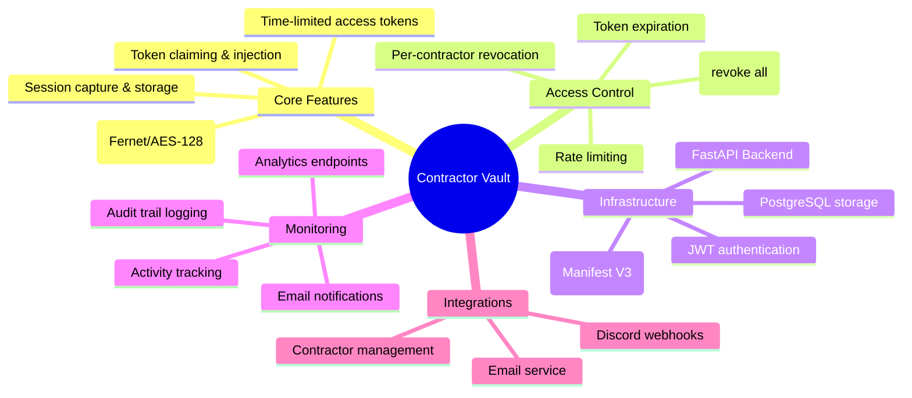
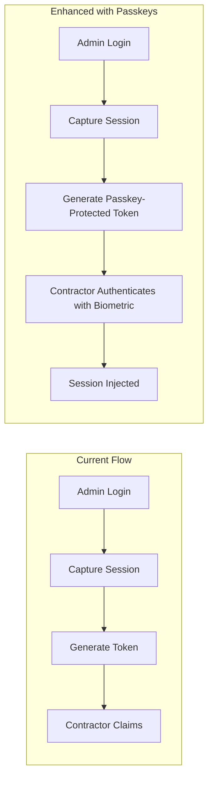
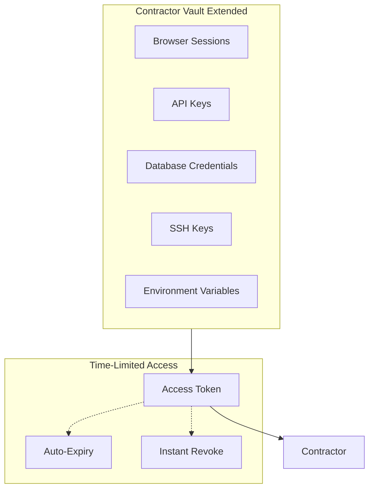
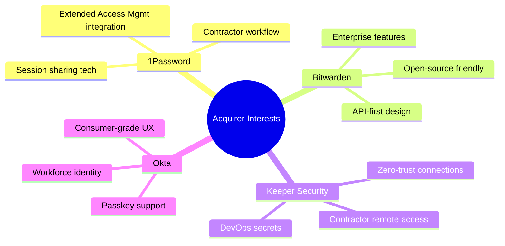

# 🔐 Password Manager Acquisition Landscape
## Strategic Research for Contractor Vault

*Last Updated: December 28, 2025*

---

## Executive Summary

This document analyzes the password management acquisition landscape to identify what makes companies attractive acquisition targets, with specific recommendations for positioning **Contractor Vault** for acquisition by major players like 1Password, Bitwarden, Dashlane, or Keeper Security.

> [!IMPORTANT]
> The password management market is rapidly consolidating around **four key technology pillars**: passwordless authentication, device trust/zero trust, secrets management, and SaaS access management. Contractor Vault's unique position in **session sharing and contractor access management** aligns closely with these trends.

---

## Part 1: Acquisition Landscape Analysis

### 1Password Acquisitions (Most Active Acquirer)

1Password has made **4 strategic acquisitions** since 2021, demonstrating a clear expansion strategy:

| Company | Date | Price | Technology | Strategic Rationale |
|---------|------|-------|------------|---------------------|
| **Trelica** | Jan 2025 | Undisclosed | SaaS access management, shadow IT discovery | Extend XAM platform to manage unmanaged apps |
| **Kolide** | Feb 2024 | Undisclosed | Device health & contextual access | Zero Trust device security for hybrid workforce |
| **Passage Identity** | Nov 2022 | **~$24M** (equity) | Passwordless/passkey authentication | Enterprise passwordless future |
| **SecretHub** | Apr 2021 | Undisclosed | Infrastructure secrets for DevOps | API tokens, keys, certificates management |

#### Key Insights from 1Password's Strategy:
- **Extended Access Management (XAM)** is their flagship vision—going beyond traditional password management
- Focus on **"user-first security"** and making security accessible
- Acquiring **developer-friendly tools** with strong API offerings
- Building toward **Zero Trust architecture**

---

### Bitwarden Acquisition

| Company | Date | Price | Technology |
|---------|------|-------|------------|
| **Passwordless.dev** | Jan 2023 | Undisclosed | FIDO2/WebAuthn passwordless APIs |

**Why They Acquired**: Bitwarden wanted to integrate modern passwordless standards (passkeys) into their open-source platform. The acquisition came after a **$100M funding round** aimed at accelerating product development.

---

### Keeper Security Acquisition

| Company | Date | Price | Technology |
|---------|------|-------|------------|
| **Glyptodon** | Feb 2022 | Undisclosed | Zero-trust remote access (Apache Guacamole) |

**Why They Acquired**: Glyptodon's remote access technology was integrated as **Keeper Connection Manager** to provide zero-trust remote access for IT administrators, SREs, and DevOps teams.

---

### Okta Acquisition (Adjacent Market)

| Company | Date | Price | Technology |
|---------|------|-------|------------|
| **Uno** | Oct 2023 | Undisclosed | Consumer password manager, passkey support |
| **Spera Security** | Feb 2024 | **~$80M** | Identity threat detection |
| **Axiom Security** | Aug 2025 | **$100M** | Privileged Access Management |

**Why They Acquired Uno**: Okta specifically wanted Uno's **consumer-first, design-focused** approach to accelerate their **Okta Personal** offering. The Uno team was praised for making security "inviting rather than technical."

---

### LastPass History

| Event | Year | Details |
|-------|------|---------|
| Acquired **Xmarks** | 2010 | Browser bookmark/password sync |
| Acquired by **LogMeIn** | 2015 | **$110M** + $15M contingent |
| Spun off as independent | 2024 | Controlled by Francisco Partners & Elliott |

**Key Lesson**: Even established password managers can be acquired. LastPass's **$110M acquisition** in 2015 remains a benchmark for the market.

---

## Part 2: What Makes Companies Attractive Acquisition Targets

Based on analyzed acquisitions, these are the **proven differentiators** that drove acquisition interest:

### 🏆 Tier 1: Highest Value Technologies

| Technology | Why Valuable | Acquired Examples |
|------------|--------------|-------------------|
| **Passwordless/Passkey Auth** | Future of authentication; FIDO2 standard | Passage (~$24M), Passwordless.dev, Uno, Cotter |
| **Device Trust & Zero Trust** | Remote work security; contextual access | Kolide ($27M funded), Glyptodon |
| **Secrets Management** | DevOps/infrastructure credentials | SecretHub |

### 🥈 Tier 2: Strong Value Technologies

| Technology | Why Valuable | Acquired Examples |
|------------|--------------|-------------------|
| **SaaS Access Management** | Shadow IT discovery; app visibility | Trelica |
| **Remote Access** | Zero-trust connections | Glyptodon |
| **Privileged Access Management** | Enterprise security critical | Axiom (~$100M) |

### 🥉 Tier 3: Foundation Technologies

| Technology | Why Valuable | Notes |
|------------|--------------|-------|
| **User-Friendly UX** | Consumer adoption barrier | Uno specifically acquired for UX |
| **Cross-Platform Sync** | Table stakes; required | All modern managers |
| **Enterprise Features** | SSO, SCIM, audit trails | Premium tier requirement |

---

## Part 3: Contractor Vault Current State Analysis

Based on the codebase review, here's Contractor Vault's current feature set:



### Current Technical Architecture

| Component | Technology | Status |
|-----------|------------|--------|
| **Backend API** | FastAPI + SQLAlchemy | ✅ Solid |
| **Database** | PostgreSQL (prod) / SQLite (dev) | ✅ Standard |
| **Extension** | Chrome Manifest V3 | ✅ Modern |
| **Encryption** | Fernet (AES-128-CBC) | ✅ Secure |
| **Rate Limiting** | slowapi | ✅ Implemented |
| **Audit Trail** | Custom logging | ✅ Good foundation |

### API Endpoints (Current)

| Router | Purpose | Acquisition Relevance |
|--------|---------|----------------------|
| `/api/access` | Token generation, claiming, revocation | ⭐ Core value |
| `/api/sessions` | Session storage and sharing | ⭐ Core value |
| `/api/credentials` | Credential management | ⭐ Core value |
| `/api/contractors` | Contractor user management | ⭐ Differentiator |
| `/api/audit` | Audit trail access | ✅ Enterprise need |
| `/api/analytics` | Usage analytics | ✅ Enterprise need |
| `/api/activity` | Activity tracking | ✅ Enterprise need |
| `/api/email` | Email notifications | ✅ Nice to have |
| `/api/auth` | Authentication | ✅ Standard |

---

## Part 4: Strategic Recommendations for Acquisition

### 🎯 Positioning Strategy

Contractor Vault occupies a **unique niche** that aligns with current acquisition trends:

> [!TIP]
> **Your Unique Angle**: "Secure contractor access without password sharing"
> 
> This positions you at the intersection of:
> - **Session management** (like 1Password's sessions)
> - **Temporal access control** (like Kolide's contextual access)
> - **Contractor management** (enterprise compliance need)

---

### 🚀 Recommended Feature Additions

These recommendations are prioritized by **acquisition attractiveness** and **development complexity**:

#### Priority 1: Passwordless/Passkey Integration
**Why**: Every recent acquisition (Passage, Passwordless.dev, Uno, Cotter) has this technology.



**Implementation Ideas**:
1. Add WebAuthn support for token claiming (biometric verification)
2. Integrate passkey registration for contractors
3. Support for device-bound credentials

**Estimated Effort**: Medium (2-4 weeks)
**Acquisition Value Increase**: High (+$5-15M potential)

---

#### Priority 2: Device Trust & Health Monitoring
**Why**: Kolide was acquired specifically for this. Remote work security is critical.

**Current Gap**: Contractor Vault validates tokens but not the device claiming them.

**Recommended Features**:
| Feature | Description | Benefit |
|---------|-------------|---------|
| Device fingerprinting | Track which devices access tokens | Security + Audit |
| OS/Browser validation | Require specific configurations | Compliance |
| Location-based access | Geo-restrict token claiming | Risk reduction |
| Device health checks | Verify security posture before access | Zero Trust |

**Implementation Example**:
```python
# Enhanced claim endpoint with device context
@router.post("/api/access/claim/{token}")
async def claim_with_device_context(
    token: str,
    device_context: DeviceContext,  # NEW
    db: Session = Depends(get_db)
):
    # Validate device health before allowing claim
    if not validate_device_health(device_context):
        raise HTTPException(403, "Device does not meet security requirements")
    
    # Existing claim logic...
```

**Estimated Effort**: Medium-High (3-6 weeks)
**Acquisition Value Increase**: High (+$10-20M potential)

---

#### Priority 3: Secrets Management Extension
**Why**: SecretHub was acquired to add infrastructure secrets to 1Password's portfolio.

**Current State**: Contractor Vault handles browser sessions/cookies.

**Expansion Opportunity**:
| Secret Type | Current | Recommended |
|-------------|---------|-------------|
| Browser cookies | ✅ | ✅ |
| Session tokens | ✅ | ✅ |
| API keys | ❌ | ✅ Add |
| Database credentials | ❌ | ✅ Add |
| SSH keys | ❌ | ✅ Add |
| Environment variables | ❌ | ✅ Add |

**New Use Case**: "Share temporary API access with contractors"



**Estimated Effort**: High (4-8 weeks)
**Acquisition Value Increase**: Very High (+$15-25M potential)

---

#### Priority 4: SaaS Discovery & Shadow IT
**Why**: Trelica was acquired (Jan 2025) specifically for this capability.

**Current Gap**: Contractor Vault tracks what sessions are shared, but not unauthorized app usage.

**Recommended Features**:
1. **Session Detection**: Auto-detect when contractors log into new services
2. **App Inventory**: Build a catalog of all SaaS apps contractors access
3. **Risk Scoring**: Flag high-risk or unauthorized applications
4. **Access Reports**: Show admins what apps are being used

**This enhances your existing `detected_signup.py` model:**

| Current | Enhanced |
|---------|----------|
| Detect signups | Detect all SaaS access |
| Manual review | Automated risk scoring |
| Basic logging | Rich analytics dashboard |

**Estimated Effort**: Medium (3-5 weeks)
**Acquisition Value Increase**: High (+$10-15M potential)

---

### 📊 Acquisition Value Estimation

Based on comparable acquisitions:

| Company State | Estimated Range | Comparable |
|---------------|-----------------|------------|
| **Current** (session sharing only) | $2-5M | Early-stage acqui-hire |
| **+ Passkeys** | $8-15M | Similar to Passage (~$24M) |
| **+ Device Trust** | $15-25M | Similar to Kolide (raised $27M) |
| **+ Secrets Management** | $25-40M | Combined value proposition |
| **+ SaaS Discovery** | $35-50M+ | Full enterprise platform |

---

## Part 5: Target Acquirer Analysis

### Most Likely Acquirers for Contractor Vault

| Company | Fit Score | Why They'd Acquire | What They Lack |
|---------|-----------|-------------------|----------------|
| **1Password** | ⭐⭐⭐⭐⭐ | Expands XAM into contractor access | Contractor-specific workflow |
| **Bitwarden** | ⭐⭐⭐⭐ | Adds enterprise contractor management | Time-limited sessio sharing |
| **Keeper Security** | ⭐⭐⭐⭐ | Complements connection manager | Contractor onboarding |
| **Dashlane** | ⭐⭐⭐ | Enterprise expansion | Contractor access patterns |
| **Okta** | ⭐⭐⭐ | Workforce identity extension | Session-based access |
| **CyberArk** | ⭐⭐⭐ | Privileged access for contractors | Browser-based sessions |

### What Each Acquirer Would Value Most



---

## Part 6: Action Plan & Roadmap

### Immediate Actions (Next 30 Days)

| Action | Priority | Effort | Impact |
|--------|----------|--------|--------|
| Add device fingerprinting to claims | High | 1 week | Security differentiation |
| Implement basic passkey support for extension | High | 2 weeks | Modern auth story |
| Create enterprise admin dashboard | Medium | 2 weeks | Enterprise appeal |
| Add API key sharing capability | Medium | 1 week | Secrets expansion |

### Short-Term (60-90 Days)

| Action | Priority | Effort | Impact |
|--------|----------|--------|--------|
| Full WebAuthn/passkey authentication | High | 3 weeks | Acquisition critical |
| Device health verification | High | 3 weeks | Zero Trust story |
| SaaS app detection engine | Medium | 4 weeks | Shadow IT capability |
| SOC 2 compliance preparation | Medium | Ongoing | Enterprise requirement |

### Medium-Term (6 Months)

| Action | Priority | Effort | Impact |
|--------|----------|--------|--------|
| Multi-cloud secrets management | High | 6 weeks | Secrets platform |
| Enterprise SSO integration | High | 4 weeks | Large customer sales |
| Customer case studies | Medium | 2 weeks | Social proof |
| Geographic expansion (EU) | Medium | 4 weeks | Market reach |

---

## Part 7: Competitive Positioning

### Unique Value Proposition

> **"The only platform built specifically for secure contractor session access"**

| Feature | Contractor Vault | 1Password | Bitwarden | LastPass |
|---------|-----------------|-----------|-----------|----------|
| Session sharing | ⭐⭐⭐⭐⭐ | ⭐⭐ | ⭐ | ⭐ |
| Time-limited access | ⭐⭐⭐⭐⭐ | ⭐⭐⭐ | ⭐⭐ | ⭐⭐ |
| Contractor management | ⭐⭐⭐⭐⭐ | ⭐ | ⭐ | ⭐ |
| Instant revocation | ⭐⭐⭐⭐⭐ | ⭐⭐⭐ | ⭐⭐ | ⭐⭐ |
| Audit trail | ⭐⭐⭐⭐ | ⭐⭐⭐⭐ | ⭐⭐⭐ | ⭐⭐⭐ |
| Password storage | ⭐⭐ | ⭐⭐⭐⭐⭐ | ⭐⭐⭐⭐⭐ | ⭐⭐⭐⭐⭐ |

### Key Differentiators to Emphasize

1. **Session-Based Access**: Share authenticated sessions, not passwords
2. **Contractor-First Design**: Built specifically for contractor workflows
3. **Temporal Access Control**: Every access has an expiration
4. **Zero Password Exposure**: Contractors never see the actual credentials
5. **Instant Kill Switch**: Revoke all access with one click

---

## Appendix: Technical Implementation Details

### Current Contractor Vault Architecture

```
contractor-vault/
├── backend/
│   ├── app/
│   │   ├── main.py              # FastAPI application
│   │   ├── routers/
│   │   │   ├── access.py        # Token generation, claiming, revocation
│   │   │   ├── sessions.py      # Session storage and sharing
│   │   │   ├── credentials.py   # Credential management
│   │   │   ├── contractor.py    # Contractor user management
│   │   │   ├── audit.py         # Audit trail
│   │   │   ├── analytics.py     # Usage analytics
│   │   │   ├── activity.py      # Activity tracking
│   │   │   ├── email.py         # Email notifications
│   │   │   └── auth.py          # Authentication
│   │   ├── models/              # SQLAlchemy models
│   │   ├── services/            # Business logic
│   │   └── utils/               # Helpers
├── extension/
│   ├── manifest.json            # Chrome Manifest V3
│   ├── background.js            # Service worker
│   ├── popup/                   # Extension UI
│   └── icons/                   # Extension icons
└── dashboard/                   # Next.js admin dashboard
```

### Security Model (Acquisition Strength)

| Layer | Implementation | Industry Standard |
|-------|----------------|-------------------|
| Transport | HTTPS/TLS | ✅ Required |
| Authentication | JWT with expiry | ✅ Standard |
| Encryption at Rest | Fernet (AES-128-CBC) | ✅ Strong |
| Rate Limiting | 5-30 req/min per IP | ✅ Good |
| CORS | Extension + Dashboard only | ✅ Proper |
| Audit Trail | Immutable logging | ✅ Enterprise requirement |

---

## Summary

Contractor Vault is well-positioned for acquisition with enhancements in:

1. ✅ **Passwordless/Passkey Authentication** - Highest value addition
2. ✅ **Device Trust & Health Monitoring** - Zero Trust differentiator  
3. ✅ **Secrets Management Extension** - Platform expansion
4. ✅ **SaaS Discovery & Shadow IT** - Enterprise compliance value

> [!NOTE]
> **Estimated Acquisition Range**: $25M-50M with recommended enhancements
> 
> **Most Likely Acquirer**: 1Password (best strategic fit with XAM vision)
> 
> **Timeline to Acquisition-Ready**: 6-12 months with focused development
